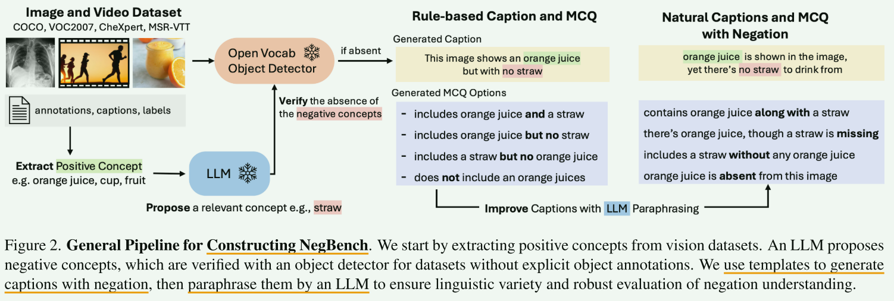
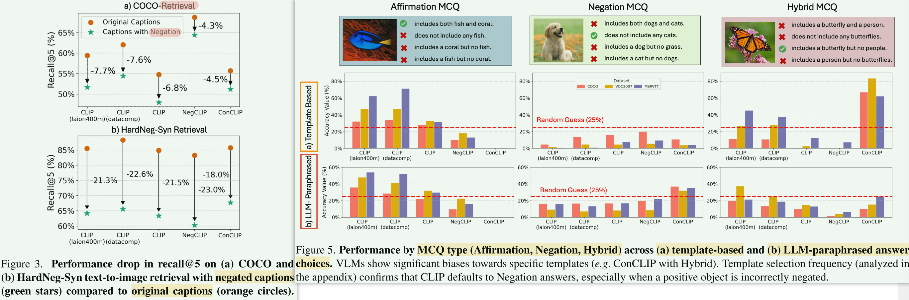

# NegBench 数据集介绍

`by：xjh 2025/3/16`

## 数据集概述

`data/` 目录包含用于评估视觉语言模型（VLMs）**否定理解能力**的数据集。该数据集涵盖了多种视觉任务，包括**多项选择（MCQ）**和**检索（Retrieval）**任务。





### 目录结构

```
data/
├── images/
│   ├── MCQ/
│   │   ├── COCO_val_mcq_llama3.1_rephrased.csv
│   │   ├── VOC2007_mcq_llama3.1_rephrased.csv
│   │   ├── synthetic_mcq_llama3.1_rephrased.csv
│   ├── Retrieval/
│   │   ├── COCO_val_retrieval.csv
│   │   ├── COCO_val_negated_retrieval_llama3.1_rephrased_affneg_true.csv
│   │   ├── synthetic_retrieval_v1.csv
│   │   └── synthetic_retrieval_v2.csv
├── videos/
│   ├── MCQ/
│   │   ├── msr_vtt_mcq_rephrased_llama.csv
│   ├── Retrieval/
│   │   ├── msr_vtt_retrieval.csv
│   │   └── msr_vtt_retrieval_rephrased_llama.csv
```

------

## images 文件夹

### **1. 多项选择任务（MCQ）**

#### **COCO_val_mcq_llama3.1_rephrased.csv**

**描述**：

- 评估模型对肯定、否定和混合陈述的理解能力。

**字段**：

- `image_path`：图像路径。
- `correct_answer`：正确答案的索引（0-3）。
- `caption_0` ~ `caption_3`：不同的描述，包含肯定、否定或混合表达。
- `correct_answer_template`：答案类型（`affirmation`、`negation`、`hybrid`）。

其他 MCQ 文件（`VOC2007_mcq_llama3.1_rephrased.csv`、`synthetic_mcq_llama3.1_rephrased.csv`）具有相似格式，但数据来源不同。

------

### **2. 标准检索任务（Retrieval）**

#### **COCO_val_retrieval.csv**

**描述**：

- 评估模型在标准检索任务中的表现。

**字段**：

- `positive_objects`：图像中存在的物体列表。
- `negative_objects`：图像中缺失的物体列表。
- `filepath`：图像文件路径。
- `image_id`：图像 ID。
- `captions`：图像的多个**原始文本描述**。

------

### **3. 否定检索任务（Negated Retrieval）**

#### **COCO_val_negated_retrieval_llama3.1_rephrased_affneg_true.csv**

**描述**：

- 在标准检索任务的基础上，**对文本描述加入否定表达**，用于测试模型对否定信息的理解。

**字段**：

- `positive_objects`：图像中存在的物体列表。
- `negative_objects`：图像中缺失的物体列表。
- `filepath`：图像文件路径。
- `image_id`：图像 ID。
- `captions`：图像的多个**包含否定信息的文本描述**。

其他否定检索文件（`synthetic_retrieval_v1.csv`、`synthetic_retrieval_v2.csv`）采用类似结构，但数据是合成数据。

------

## videos 文件夹

### **1. 多项选择任务（MCQ）**

#### **msr_vtt_mcq_rephrased_llama.csv**

**描述**：

- 评估模型对视频内容的肯定和否定信息的理解能力。

**字段**：

- `correct_answer`：正确答案的索引（0-3）。
- `caption_0` ~ `caption_3`：不同的描述，包含肯定、否定或混合表达。
- `correct_answer_template`：答案类型（`positive`、`negative`、`hybrid`）。
- `image_path`：视频文件的路径。

------

### **2. 标准检索任务（Retrieval）**

#### **msr_vtt_retrieval.csv**

**描述**：

- 评估模型在视频检索任务中的表现。

**字段**：

- `image_id`：视频的唯一标识符。
- `captions`：与该视频最相关的主要描述。
- `filepath`：视频文件路径。
- `all_captions`：该视频的所有原始描述。

------

### **3. 否定检索任务（Negated Retrieval）**

#### **msr_vtt_retrieval_rephrased_llama.csv**

**描述**：

- 经过 LLaMA 3.1 重新措辞的检索任务，增加语言多样性，以测试模型对否定信息的理解能力。

**字段**：

- `image_id`：视频的唯一标识符。
- `captions`：**包含否定信息**的文本描述。
- `filepath`：视频文件路径。
- `all_captions`：该视频的所有原始描述。
- `positive_concept1`：视频中的关键正向概念。
- `positive_concept2`：视频中的另一个正向概念。
- `negative_concept`：视频中明确不存在的概念。

----

## 数据集图像下载

1. **VOC2007**
   - **[从官方链接](http://host.robots.ox.ac.uk/pascal/VOC/voc2007/VOCtest_06-Nov-2007.tar)**下载图像。
   - 提取数据集并确保 CSV 文件中的文件路径指向正确的目录。
2. **COCO 2017 验证集**
   - **[从COCO 数据集](https://cocodataset.org/#download)**下载 2017 年验证图像。
   - 更新COCO CSV 文件中的`image_path`和列。`filepath`
3. **MSR-VTT 视频**
   - **[从MediaFire 链接](https://www.mediafire.com/folder/h14iarbs62e7p/shared)**下载视频。
   - 更新相关 CSV 文件中的`image_path`和列。`filepath`
4. **合成数据集（稳定扩散）**
   - NegBench 中引入的合成数据集对应的图像将很快上传。请回来查看更新。