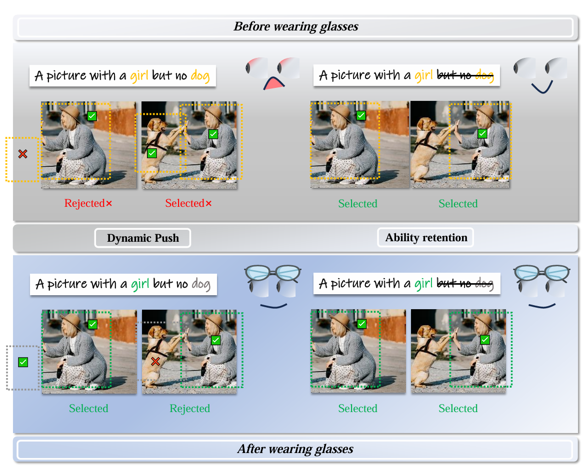
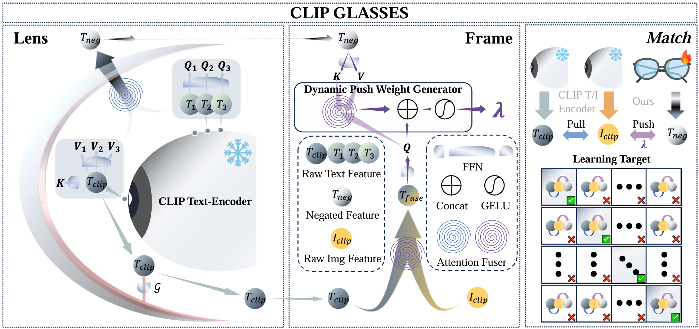

# CLIPGlasses

> *European Conference on Artificial Intelligence*  🚩

Vision-Language Models (VLMs) such as CLIP have shown impressive performance across various multimodal tasks. However, they continue to struggle with accurately capturing the semantics of negation. Specifically, these models frequently embed negative and affirmative sentences into nearly identical representations, which leads to failures in cross-modality alignment. For instance, the phrase “no dog” might be erroneously matched with images containing dogs. In this paper, we propose CLIPGlasses, a plug-and-play framework designed to mitigate VLMs’ systematic bias in negation understanding—e.g., mismatching “no dog” with dog-containing images. Inspired by the human cognitive process of interpreting negation in two stages, CLIPGlasses adopts a dual-stage design. The Lens module employs a syntax-semantic dual-stream to extract both shallow syntactic features and deep semantic features from the CLIP encoder. These are fused via cross-layer attention and refined through residual gating to yield structurally informed and semantically precise negation representations. The Frame module introduces a cross-modal repulsion mechanism that conditionally adjusts image-text alignment: when a conditional mask detects negation, a learned repulsion weight λ is activated to selectively suppress similarity scores and correct false matches. Experiments show CLIP integrated with CLIPGlasses achieves 96.56% accuracy on the CC-Neg dataset, while maintaining performance on standard benchmark. 

