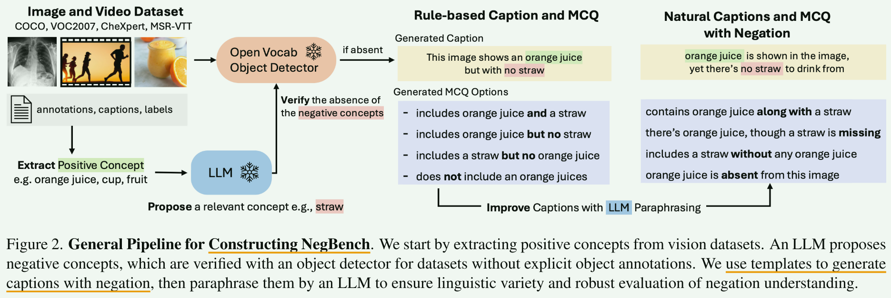

# CLIP 否定

### 🐱‍👤标准CLIP

#### **标注CLIP训练损失：**

> **CLIP 损失本质上可以看作是在相似度矩阵的行和列上分别应用 InfoNCE 损失**，即 CLIP 损失是 **双向 InfoNCE（对称的 InfoNCE）**

**> 相似度矩阵计算**

假设 CLIP 的批量大小为 $N$，批次中图像 $I_N = {I_1, I_2, ..., I_N}$ 和对应的文本描述 $T_N = {T_1, T_2, ..., T_N}$。CLIP 计算 **图像编码** $f_i(I_j) \in \mathbb{R}^d$ 和 **文本编码** $f_t(T_k) \in \mathbb{R}^d$，然后计算**相似度矩阵** $S \in \mathbb{R}^{N \times N}$：

$$
S_{j,k} = \text{Cosine Similarity}(f_i(I_j), f_t(T_k))
$$

> $\text{Cosine Similarity}(A,B)=\frac{\mathbf{A} \cdot \mathbf{B}}{||\mathbf{A}|| \cdot ||\mathbf{B}||}$
>
> 需要注意的是CLIP在计算 $S$ 前**已经分别对$\mathbf{A},\mathbf{B}$进行了L2归一化**，因此代码中采用**直接点积**$\mathbf{A} \cdot \mathbf{B}$的方式进行**相似度计算**。

**> 行方向softmax归一化 - 交叉熵损失**

* 目标：让每张图像 $I_j$ 的正确文本匹配 $T_j$ 在所有可能的文本中得分最高。

* 实现：将 **第 j 行** 视为一个 **分类任务**，正确的匹配 $T_j$ 作为正样本，其他 $N-1$ 个文本作为负样本： 
  $$
  \mathcal{L}_{\text{image}} = -\frac{1}{N} \sum_{j=1}^{N} \log \frac{\exp(S_{j,j} / \tau)}{\sum_{k=1}^{N} \exp(S_{j,k} / \tau)}
  $$

  > $\tau$ 是 温度缩放 超参数

**> 列方向softmax归一化 - 交叉熵损失**

* 目标：让每个文本 $T_k$ 的正确图像匹配 $I_k$ 在所有可能的图像中得分最高。

* 实现：将 **第 k 列** 视为一个 **分类任务**，正确的匹配 $I_k$ 作为正样本，其他 $N-1$ 张图像作为负样本： 
  $$
  \mathcal{L}_{\text{text}} = -\frac{1}{N} \sum_{k=1}^{N} \log \frac{\exp(S_{k,k} / \tau)}{\sum_{j=1}^{N} \exp(S_{j,k} / \tau)}
  $$

**> 总体损失**

最终的 CLIP 损失是 **行损失** 和 **列损失** 的均值：
$$
\mathcal{L} = \frac{1}{2} (\mathcal{L}_{\text{image}} + \mathcal{L}_{\text{text}})
$$

---

### 2023-NegCLIP-VLMs是词袋-vision-language-models-are-bows

> 旨在解决“词袋”问题，未解决“否定”不理解问题

#### ARO基准-评估对象与属性的组合关系

当前的大规模视觉-语言模型（Vision-Language Models, VLMs）已广泛应用于各种下游任务，但它们在**对象与属性的组合关系、顺序**方面的表现仍不明确。本文提出**ARO基准（Attribution, Relation, and Order benchmark）**，用于系统性地评估 VLMs 在以下方面的理解能力：

1. **属性理解**：通过 **Visual Genome Attribution** 测试模型对对象属性的理解能力。

   

2. **关系理解**：通过 **Visual Genome Relation** 测试模型对对象之间关系的理解能力。

   

3. **顺序敏感性**：通过 **COCO-Order & Flickr30k-Order** 评估模型对**图像-文本匹配中的顺序信息**的敏感性。

   > 原句子；仅打乱名词和形容词；打乱除名词和形容词外的所有词；打乱三元组；在三元组内打乱单词

   

ARO 数据集规模比以往的组合性评测基准大 **多个数量级**，包含超过 **50,000 个测试样本**。

#### **发现问题**

在实验中，研究者发现**当前最先进的 VLMs 仍然像“词袋模型”（Bag-of-Words）一样工作**，即：

- **关系理解能力较差**：难以正确识别对象之间的关联。
- **属性匹配错误**：容易将错误的属性分配给对象。
- **对顺序不敏感**：无法正确解析句子中描述顺序的影响。

**原因：**

- 现有的数据集允许 VLMs 在 **图像-文本检索任务** 上表现良好，而无需真正理解**组合关系和顺序信息**。

  

- 这表明，VLMs 可能通过 **捷径** 完成任务，而不是学会真正的组合性表示。

#### **解决方案-基于组合关系的困难负样本挖掘**

研究者提出了一种 **基于组合关系的困难负样本挖掘** 方法。

- **邻近图像负样本**：计算**所有图像之间的相似性**（cosine similarity）。在训练过程中，为每张图像**选取 K=3 个最相似的替代图像**，并加入到批次（batch）中作为 **Hard Negatives**。
- **生成错误描述**：在每个训练批次中加入**打乱顺序的文本描述** (交换名词&交换动词短语)，迫使模型更好地学习**对象、属性和顺序关系**。
- **微调方法：**标准 CLIP 计算图像-文本相似性矩阵 **S ∈ ℝᴺ×ᴺ**（N 是批次大小），并使用 **infoNCE损失**（softmax+cross-entropy） 进行训练。在 NegCLIP 中，研究者**额外加入负面字幕 $T^⁻$**，构造一个**新的相似性矩阵** **Ŝ ∈ ℝᴺײᴺ**。计算损失时：
  - **正样本（原始描述）**：**正常计算损失**。
  - **负样本（扰动描述）**：只计算**行损失**（不计算列损失，<u>因为负样本描述没有对应的图像</u>）。
- **结果表明：**这种方法**显著提高了模型在组合性理解任务上的表现**。

---

### 2024-CoN-CLIP-Learn “No” to Say “Yes” Better: Improving Vision-Language Models via Negations

#### 问题：走捷径式学习导致忽略否定词

对比学习的目标是针对检索任务进行优化，已被证明会鼓励“**走捷径式学习**”，导致模型表现得像只考虑单词组合的“**词袋**”模型，**对语义的关系理解不完整**[57]。像CLIP[43]这样的视觉-语言模型常常会**忽略否定词**，比如“no（没有、不）”、“not（不）”和“without（没有）” 。

#### CC-Neg数据集

我们开发了一个全面的**基准**，来**评估视觉-语言模型理解明确否定词的能力**。我们贡献了**CC-Neg数据集**，其中包含228,246个图像-文本对，以及语法正确且流畅的否定文本描述。

> **CC-Neg数据集构建**：将文本分解为一个主语和K个谓词-对象对，并**随机否定一个谓语-对象对**，从而获得**否定文本**

#### CoN-CLIP模型（新目标-微调文本编码器）

对 **CLIP** 的 **对比学习目标** 进行了修改，以增强其对**否定**的理解能力。

**> 3 个相似度矩阵**

1. **真实图像与所有文本的相似度（$P$）**

   - 计算 **真实图像嵌入 $E_I$ ** 与 **文本嵌入（包括原始文本 $E_C$ 和否定文本 $E_{C'}$′）** 的 **余弦相似度**，形成**相似度矩阵** $P \in \mathbb{R}^{M \times 2M}$，经过 **$\tau$ 温度缩放** 和 **列方向 softmax 归一化**，得到 $\tilde{P}$。

   - 计算infoNCE损失函数（softmax+cross-entropy）：
     $$
     P_{i,j} = \frac{f_i(I_i) \cdot f_t(T_j)}{\|f_i(I_i)\| \|f_t(T_j)\|}
     $$

     $$
     \tilde{P}_{i,j} = \frac{\exp(P_{i,j} / \tau)}{\sum_{k=1}^{2M} \exp(P_{i,k} / \tau)}
     $$

     $$
     \mathcal{L}_\text{image} = -\frac{1}{M} \sum_{i=1}^{M} \sum_{j=1}^{2M} \mathbb{1}_{\{i = j\}} \log (\tilde{P}_{ij})
     $$

     > 该损失用于优化 **图像对文本的匹配能力**。

2. **真实文本与所有图像的相似度（$Q$）**

   - 计算 **真实文本嵌入 $E_C$** 与 **图像嵌入（包括原始图像 EIE_IEI 和干扰图像 $E_{I'}$）** 的 **余弦相似度**，形成相似度矩阵 $Q \in \mathbb{R}^{M \times 2M}$，经过**$\tau$ 温度缩放**和 **列方向 softmax 归一化** 后，得到 $\tilde{Q}$。

   - 计算infoNCE损失函数： 
     $$
     \mathcal{L}_\text{text} = -\frac{1}{M} \sum_{i=1}^{M} \sum_{j=1}^{2M} \mathbb{1}_{\{i = j\}} \log (\tilde{Q}_{ij})
     $$

     > 该损失用于优化 **文本对图像的匹配能力**。

3. **干扰图像与所有文本的相似度（$R$）**

   - 计算 **干扰图像嵌入 $E_{I'}$** 与 **文本嵌入（包括原始文本 $E_C$ 和否定文本 $E_{C'}$）** 的 **余弦相似度**，形成相似度矩阵$R \in \mathbb{R}^{M \times 2M}$ ，经过和 **$\tau$ 温度缩放** 和 **列方向softmax归一化** 后，得到 $tilde{R}$。

   - 计算infoNCE损失函数：
     $$
     \mathcal{L}_\text{error-img} = -\frac{1}{M} \sum_{i=1}^{M} \sum_{j=1}^{2M} \mathbb{1}_{\{i = j\}} \log (\tilde{R}_{ij})
     $$

     > 该损失**防止模型找捷径**（故意绕开所有否定文本）。

**> 最终损失函数**

综合上述 3 个损失，定义最终对比损失：
$$
\mathcal{L}_{\text{conclip}} = \frac{1}{3} (\mathcal{L}_\text{image} + \mathcal{L}_\text{text} + \mathcal{L}_\text{error-img})
$$
**> 微调策略**

- **冻结 CLIP 的图像编码器**，仅对 **文本编码器** 进行微调，以提升其对否定描述的理解能力。
- 采用 **AdamW 优化器**（权重衰减 0.2），**初始学习率 $1e^{-6}$**，并使用 **余弦调度** 进行学习率衰减，**预热 50 步（warmup steps）**。
- 训练 **batch size 设为 256**，在 **NVIDIA V100 GPU** 上使用 **PyTorch** 进行实验。

---

### 2025-NegationCLIP-让CLIP更好地理解”否定“表述

尽管CLIP在多模态理解方面取得了显著进展，但在**理解和区分否定概念（如“停车”与“禁止停车”）方面存在挑战**。

**原因：**CLIP的预训练数据中，**包含否定词汇的描述性文本比例极低**，且这些**否定词汇往往与图像内容对齐不佳**，导致模型在训练过程中缺乏对否定概念的学习。

**解决：**

1. **两种数据生成管道**：分别基于 **LLM（大语言模型）** 和 **MLLM（多模态大模型）**，旨在解决 CLIP 训练数据中的两大问题：**否定表达的稀缺** 以及 **文本与视觉内容的错位**。

   

2. **模型微调**：通过在生成的数据上微调CLIP的文本编码器，开发出一个名为**NegationCLIP**的模型，该模型在保持通用性的同时，增强了对否定概念的理解。

---

### 2025-CVPR-否定评估benchmark-Vision-Language Models Do Not Understand Negation

#### 新的VLMs否定理解基准 NegBench

一个专门用于评估视觉语言模型（VLMs）**对否定理解能力**的新基准。NegBench 涵盖了 **18 种任务变体** 和 **79,000 个示例**，数据来源包括 **图像、视频和医学数据集**。

🎈NegBench 首先是**基于模板**生成正、负描述，然后再**基于LLM**将模板描述润色为**自然语言描述**。

NegBench 由**两个核心任务**组成，分别用于在**不同模态下**测试模型的**否定理解能力**：

1. **否定检索任务**：评估模型在查询中包含否定信息时的检索能力。
2. **带否定描述的多项选择题**：测试模型对否定句的准确理解。

#### 当前已有模型对否定的错误理解

* ❌**CLIP**和**NegCLIP**：

  * 均无法对“否定”和“肯定”进行区分理解。
  * 但 **NegCLIP 对混合句的分离能力稍好**。NegCLIP 在混合类题目上的低分，可能是因为其**文本和图像编码器之间存在错位（misalignment）**，而**不完全是因为它无法理解混合句**。

  > 其中**NegCLIP**旨在处理CLIP错误理解**对象与属性的组合关系**的问题。

* **❌ConCLIP**：

  * 只学到了**通过模板**区分“否定”和“肯定”，并未真正理解否定信息，只是简单地把**所有 “Not X” 句子**视为**相同的概念**。
  * 无法理解混合描述，所有的**混合描述**均被视为**相同的概念**。

* **✔纯文本的Sentence Transformer（对照文本模型）**：

  * 作为对照，发现它的嵌入空间能有效地**区分肯定和否定**，并且能沿着“对象类别轴”和“否定轴”进行有意义的排列。

#### 数据驱动微调CLIP提升否定理解

在NegBench上的实验结果表明，当前的**主流VLMs模型在否定理解方面表现不佳，通常仅达到随机猜测水平**。

为了解决这一问题，论文提出了一种**数据驱动的方法**，即在**大规模合成的否定描述数据集**（不是NegBench）上**微调 CLIP 模型**。结果显示，该方法可使**否定查询的召回率提高 10%**，并使**带否定描述的多项选择题的准确率提升 40%**，表明大规模数据增强在提升模型否定理解能力方面的有效性。

----

