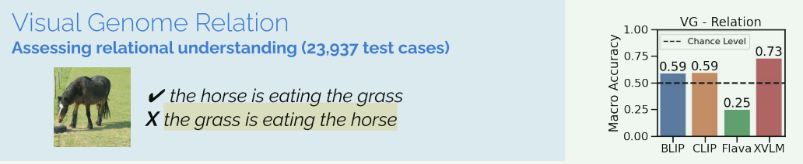
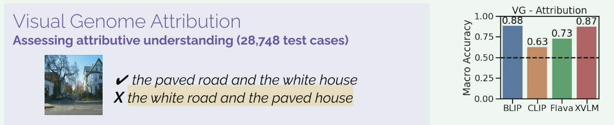
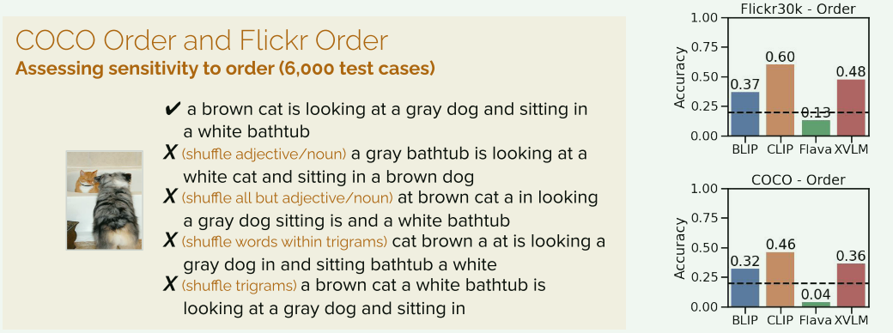
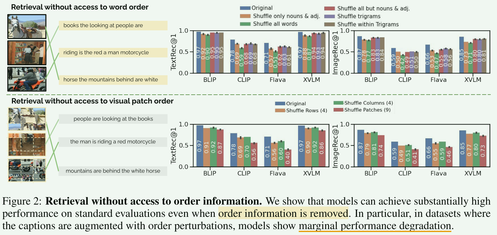
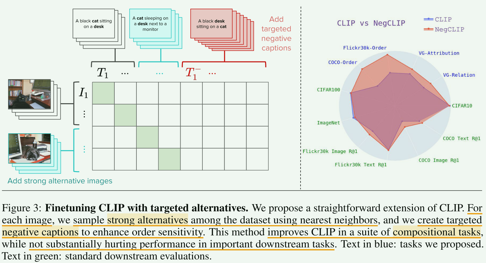
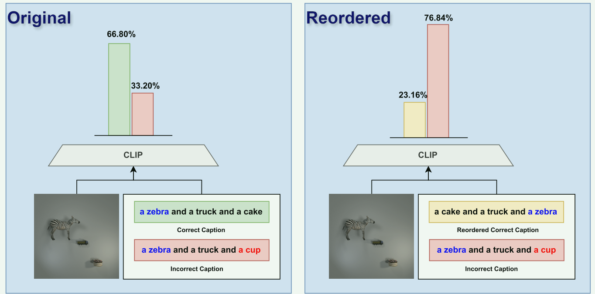

# CLIP 改进和优化

> BY:  Junhao Xiao (xiaojunhao066@gmail.com)

---

### 2025-ICLR-Clip的模态错位问题-CROSS THE GAP

**模态错位：**clip对比损失只关注**模态间（图像-文本）样本对的相似性**，忽略了**模态内样本对的相似性**。

----

### ❤2025-Clip在局部理解的细粒度任务中却举步维艰-语义特征高度相关-Disentangling CLIP Features for Enhanced Localized Understanding

#### 当前问题：

**VLMs**在**图像分类和检索等粗粒度任务**上表现优异，但在**需要局部理解的细粒度任务**中仍然存在挑战。本文对模型的特征进行了全面分析。

* **关键问题**：**语义特征高度相关**，某个类别的特征包含了其他类别的信息，即 **互信息（Mutual Feature Information, MFI）**。例如对Clip的实验发现**“人（person）-狗（dog）”的文本特征相似度高达 0.84**。
* **原因如下**：
  * 特征空间的**全局池化操作**，在 CLIP 的最终层，使用**全局池化**来聚合特征，使得 CLIP 在**全局任务**（如图像分类）上表现良好。但这种处理方式会丢失**局部信息**，影响模型在**细粒度任务**上的表现。
  * 在 CLIP 的**视觉-语言联合空间**中，**不同类别的特征相互干扰**，使得**目标类别的特征编码了其他类别的信息**。（例如，在 CLIP 进行**类别查询**时，不相关对象的区域也会被错误激活）

#### **Unmix-CLIP** 框架

为了**在降低类别间互信息、解耦类别间的相关性的同时，保留任务相关的信息**。本文提出 **Unmix-CLIP** 框架。

#### 核心思路

1. **特征提取与投影 和 MFI 损失（MFI Loss）**
   - 通过将文本特征**投影到一个“解耦空间”**，**最小化不同类别之间的互信息**，使得每个类别的特征更加独立，提高特征分离度。
   - 提出了一种新的损失函数 **MFI Loss**（Mutual Feature Independence Loss），用于**减少文本特征之间的互信息，降低类别混叠**。
2. **多标签识别（MLR, Multi-Label Recognition）**
   - 通过 多标签学习（MLR），使**图像特征**能**正确对齐**到**分离后的文本特征空间**，以提升多标签识别能力。

通过这两个关键模块，Unmix-CLIP 能够**减少 VLMs 的语义混淆问题**，提高在细粒度任务上的表现。

#### **特征提取与投影**

Unmix-CLIP **去除了 CLIP 图像编码器的最终池化层**，使得编码器的输出成为 **3D 特征张量**：
$$
f_{\theta,\text{img}}(x_i) = z_i \in \mathbb{R}^{H \times W \times d}
$$
另一方面，**文本编码器保持不变**，采用**固定的正负提示词**（$txt_{j,+}, txt_{j,-}$）来表征某**类别的存在或不存在**，并**映射到文本特征空间**：
$$
f_{\theta,\text{text}}(txt_i) = t_i \in \mathbb{R}^d
$$
Unmix-CLIP 采用**可学习的投影器**，将图像特征 $z_i$ 和文本特征 $t_i$ 映射到新的**解耦空间**：

- **图像投影器**：$z'_i \in \mathbb{R}^{H \times W \times d'}$（保持空间维度）
- **文本投影器**：$t_i \to t'_i \in \mathbb{R}^{d'}$

这使得投影后的特征能够**更适应细粒度任务**。

#### **MFI Loss（互信息损失）**

由于 CLIP 在联合视觉-语言空间中存在类别特征混淆，我们提出**MFI Loss** 来**减少不同类别之间的互信息**。核心思路是：

1. **类别特征独立化**：<u>图像特征难以直接分离成独立类别</u>，而**文本特征天生是独立的**（因为它们基于不同的类别名称或提示词）。
2. **优化目标**：**降低不同类别文本特征的相似性**，同时**保持类别内特征的高一致性**。

$$
L_{\text{MFI}} = \sum_{i=1}^{N} (S_{ii} - 1)^2 + \lambda \sum_{i=1}^{N} \sum_{\substack{j=1 \\ j \neq i}}^{N} S_{ij}^2
$$

>- $S$ 是**自相似性矩阵**，即投影后的**文本特征之间的相似度**。
>- 第一项 **防止特征坍缩**，确保**同类特征保持高一致性**（即 $S_{ii} \approx 1$）。
>- 第二项 **减少类别间互信息**，使不同类别特征的相似性 $S_{ij}$ 最小化。
>- $\lambda$ 是平衡系数，用于控制两部分的损失权重。

通过 MFI Loss，我们**减少了 CLIP 在联合特征空间中的类别混淆**，使得**不同类别的文本特征更加独立**，从而提高细粒度任务的性能。

#### **图像-文本对齐与 MLR 任务**

**MLR 任务定义**

* **多标签识别（Multi-Label Recognition，MLR）** 任务的目标是**识别与图像 $x_i$ 相关的类别子集** $C_i \subseteq {C_1, C_2, ..., C_N}$。核心目标是学习一个映射函数：$g: x_i \to \{-1,1\}^N$，其中，$g(x_i) = 1$ 表示类别存在，$g(x_i) = -1$ 表示类别不存在。

* 在 Unmix-CLIP 方案中，我们通过**对齐投影后的图像特征和文本特征**来实现 MLR 任务。

**特征对齐方法**

对于**投影后的图像特征 $z'_i$**，我们在其**每个局部位置 $(h, w)$ 进行类别检测**，方法如下：

1. 计算**该位置**的**图像特征**与**正样本文本特征** $t'_{j,+}$ 和**负样本文本特征** $t'_{j,-}$ 的**余弦相似度** $S^+_{(h,w),j}$ 和 $S^-_{(h,w),j}$ 。
2. 与**正样本文本特征** $t'_{j,+}$  的**相似性越高**，越表明**该类存在**，而与**负样本文本特征** $t'_{j,-}$ 的**相似性越高**，越表明**该类不存在**。
3. 通过**所有局部区域的相似度聚合**得到**整个图像的类别预测 logits**  $p_i$。

该方法通过**局部区域的信息**来预测**图像的整体类别**。

**ASL 损失（Asymmetric Loss）**

在**多标签数据集**中，**负样本远多于正样本导致的类别的不均衡** 是一个严重的问题。为了解决这一问题，Unmix-CLIP 采用 **Asymmetric Loss（ASL）** 进行训练（Ridnik et al., 2021），其公式如下：
$$
L_{\text{ASL}}(p^j_i) = \begin{cases}  (1 - p^j_i)^{\gamma^+} \log p^j_i, & \text{if } y^j_i = 1, \\ (p^j_{i, \delta})^{\gamma^-} \log (1 - p^j_{i, \delta}), & \text{if } y^j_i = 0, \end{cases}
$$

>- $p^j_i$ 是模型对类别 $j$ 的**预测概率**；$y^j_i$ 是**真实标签**；
>- $\gamma^+$ 和 $\gamma^-$ 控制**正负样本的不同学习率**；
>- $p^j_{i, \delta} = \max(\hat{y} - \delta, 0)$，其中 $\delta$ 是 ASL 的**偏移参数**，用于**缓解负样本远多于正样本**的问题，**减少负样本的影响**。

ASL 通过**加权正样本的学习率并抑制负样本的影响**，有效平衡类别不均衡问题。

#### 总损失函数

整体损失函数定义如下：
$$
L_{\text{Unmix-CLIP}} = L_{\text{ASL}} + \alpha L_{\text{MFI}}
$$

>  $\alpha$ 控制两个损失项之间的相对重要性。

---

### ❤ 2023-ICLR-NegCLIP-VLMs是词袋-vision-language-models-are-bows

> 旨在解决“词袋”问题，未解决“否定”不理解问题

#### ARO基准-评估对象与属性的组合关系

当前的大规模视觉-语言模型（Vision-Language Models, VLMs）已广泛应用于各种下游任务，但它们在**对象与属性的组合关系、顺序**方面的表现仍不明确。本文提出**ARO基准（Attribution, Relation, and Order benchmark）**，用于系统性地评估 VLMs 在以下方面的理解能力：

1. **属性理解**：通过 **Visual Genome Attribution** 测试模型对对象属性的理解能力。

   

2. **关系理解**：通过 **Visual Genome Relation** 测试模型对对象之间关系的理解能力。

   

3. **顺序敏感性**：通过 **COCO-Order & Flickr30k-Order** 评估模型对**图像-文本匹配中的顺序信息**的敏感性。

   > 原句子；仅打乱名词和形容词；打乱除名词和形容词外的所有词；打乱三元组；在三元组内打乱单词

   

ARO 数据集规模比以往的组合性评测基准大 **多个数量级**，包含超过 **50,000 个测试样本**。

#### **发现问题**

在实验中，研究者发现**当前最先进的 VLMs 仍然像“词袋模型”（Bag-of-Words）一样工作**，即：

- **关系理解能力较差**：难以正确识别对象之间的关联。
- **属性匹配错误**：容易将错误的属性分配给对象。
- **对顺序不敏感**：无法正确解析句子中描述顺序的影响。

**原因：**

- 现有的数据集允许 VLMs 在 **图像-文本检索任务** 上表现良好，而无需真正理解**组合关系和顺序信息**。

  

- 这表明，VLMs 可能通过 **捷径** 完成任务，而不是学会真正的组合性表示。

#### **解决方案-基于组合关系的困难负样本挖掘**

研究者提出了一种 **基于组合关系的困难负样本挖掘** 方法。

- **邻近图像负样本**：计算**所有图像之间的相似性**（cosine similarity）。在训练过程中，为每张图像**选取 K=3 个最相似的替代图像**，并加入到批次（batch）中作为 **Hard Negatives**。
- **生成错误描述**：在每个训练批次中加入**打乱顺序的文本描述** (交换名词&交换动词短语)，迫使模型更好地学习**对象、属性和顺序关系**。
- **微调方法：**标准 CLIP 计算图像-文本相似性矩阵 **S ∈ ℝᴺ×ᴺ**（N 是批次大小），并使用 **infoNCE损失**（softmax+cross-entropy） 进行训练。在 NegCLIP 中，研究者**额外加入负面字幕 $T^⁻$**，构造一个**新的相似性矩阵** **Ŝ ∈ ℝᴺײᴺ**。计算损失时：
  - **正样本（原始描述）**：**正常计算损失**。
  - **负样本（扰动描述）**：只计算**行损失**（不计算列损失，<u>因为负样本描述没有对应的图像</u>）。
- **结果表明：**这种方法**显著提高了模型在组合性理解任务上的表现**。

---

### ❤（Clip多目标匹配）2024-ECCVws-Analyzing CLIP’s Performance Limitations in Multi-Object Scenarios: A Controlled High-Resolution Study

对比语言图像预训练（CLIP）模型在**处理复杂多目标场景**中的有效性仍然**存在挑战**。

🎈本研究通过对照实验全面分析了CLIP**在多目标环境下的性能限制**。 通过两个自定义数据集，揭示了两种编码器的**显著偏差**：

* **图像编码器**偏爱**较大的对象**
* **文本编码器**优先考虑描述中**首先提到的对象**

---

### ❤（Clip多目标匹配）2025-Clip是跨模态词袋-CLIP Behaves like a Bag-of-Words Model Cross-modally but not Uni-modally

#### CLIP的BoW（bag-of-words）问题

CLIP在 **组合性（compositionality）**方面仍然面临挑战 [28]，它在理解文本和图像时，可能更关注**个别词或特征，而不是完整的语义关系**，特别是在面对**包含多个对象**的图像或文本时，难以正确地**将属性（如颜色、形状）与相应的对象关联**起来的问题。这种现象被称为**BoWness**。

> **组合性**: 指的是模型能够**灵活地组合简单概念，生成新的复杂概念**的能力。

#### **BoW可能的原因**

* ❌由于文本和图像的**单独嵌入表示中缺乏属性-对象绑定信息**，导致模型无法正确学习属性与对象之间的联系。

* ✔BoW 现象源于**表层的对齐问题**，即模型在进行**余弦相似度计算时出现了不准确的对齐**。

#### 验证 CLIP 单独的文本和图像嵌入 中是否包含属性-对象绑定信息

我们通过训练 **线性探测器** 来**识别特定类别对象的属性信息**（即在 CLIP 预训练的**冻结**表示上**训练线性分类器**，以测试其**能否分类成功**判定其是否**包含相应的语义信息**）从而**衡量 CLIP 单独的文本和图像嵌入中是否包含属性-对象绑定的信息**。

> > 在 CLEVR、PUG:SPAR 和 PUG-CLEVR 数据集上的实验结果如下：
> >
> > * 在**图像模态**上，基于**CLIP 预训练表示**训练的**线性探测器（linear probes）**的准确率远高于随机基线。例如，在 CLEVR 数据集上，图像探测器的准确率达到了 **0.66**，高于随机基线的 0.12。
> >
> > * 在**文本模态**上，情况类似，基于**文本表示**的线性探测器的准确率也高于随机基线。例如，在 PUG 数据集上的文本测试集，探测器的预测准确率为 **1.00**，远超随机基线（0.12）。
> >
> > 实验表明，在大多数情况下，**单一模态的嵌入包含正确的属性-对象绑定信息**，这表明 CLIP 的 **BoW 现象主要源于浅层的文本-图像对齐不充分**，而~~不是个体模态的特征表征不足~~。
> > 

基于这一发现，我们提出了一个新假设：CLIP 的**BoW 现象主要是由于余弦相似度计算导致的表面对齐问题**。

#### 解决BoW的方案—LABCLIP方法

通过训练一个**线性变换**层$A$（通过 **对比** **原始文本嵌入** 和 **通过置换”属性-对象“关系生成的难例负样本** 来训练的，**CLIP 的编码器在整个训练过程中保持冻结**），

使用 $A(t_i)$ 替代原文本特征 $t_i$ 来**改善CLIP的文本编码器**在跨模态对齐中的**属性-对象绑定能力**，从而增强其对**组合概念**的理解。

> **相关工作（值得借鉴）**
>
> **CLIP 视觉编码器的局限性:**
>
> * CLIP 的视觉编码器往往更倾向于**捕捉高级语义信息**，但容易忽略**关键的细粒度细节** [22, 29, 30]。
> * CLIP 的文本编码器在处理 **否定表达、空间推理、数值推理以及细微属性区分** 方面存在较大困难[13, 29]。
>
> **组合推理与模态对齐:**
>
> * **组合推理** 对于理解现实世界中的**复杂场景**至关重要，因为它决定了模型能否通过**组合简单概念**来**理解更复杂的语义关系**。
>   一些研究表明，**CLIP 在处理新颖的对象-属性组合时表现不佳** [1, 4]，这在一定程度上是因为 **CLIP 的组合推理能力较弱** [16, 27]。

---

### ❤2025-NegationCLIP-让CLIP更好地理解”否定“表述

尽管CLIP在多模态理解方面取得了显著进展，但在**理解和区分否定概念（如“停车”与“禁止停车”）方面存在挑战**。

**原因：**CLIP的预训练数据中，**包含否定词汇的描述性文本比例极低**，且这些**否定词汇往往与图像内容对齐不佳**，导致模型在训练过程中缺乏对否定概念的学习。

**解决：**

1. **两种数据生成管道**：分别基于 **LLM（大语言模型）** 和 **MLLM（多模态大模型）**，旨在解决 CLIP 训练数据中的两大问题：**否定表达的稀缺** 以及 **文本与视觉内容的错位**。

   

2. **模型微调**：通过在生成的数据上微调CLIP的文本编码器，开发出一个名为**NegationCLIP**的模型，该模型在保持通用性的同时，增强了对否定概念的理解。

---

### ❤2024-CLIP-KD-Clip知识蒸馏综述-简单的FD+MSE效果就很好-unified效果最佳

由于 CLIP 依赖于大规模计算资源，其训练出的模型通常参数量庞大，**难以部署到资源受限的环境中**。为了解决这一问题，本文研究了如何通过**知识蒸馏**来训练更小的 CLIP 模型，同时尽可能保留大模型的能力。

> **相关工作：**最先进的 **TinyCLIP [50]** 也研究了 CLIP 的蒸馏问题。TinyCLIP 的核心方法是**权重继承**，即将部分权重从训练良好的教师模型转移到小型学生模型。然而，~~这种方法要求教师和学生模型**具有相同的架构风格~~**，从而**限制了实际应用的范围**。

本文从**关系、特征、梯度和对比**等不同角度对 CLIP 知识蒸馏进行全面研究。设计了**两类知识蒸馏策略**：

1. **模仿学习（Mimicry Learning）**：让**学生模型对齐教师模型的特征表示**，这是知识蒸馏的基本框架。关键问题在于**如何构造有意义的知识**。我们利用：**对比的图像-文本关系**、**图像与文本的特征**、**梯度信息** 这些知识构造用于指导学生模型模仿教师模型的行为。
2. **交互学习（Interactive Learning）**：教师和学生模型联合进行对比学习，让学生**隐式**地从教师模型中学习。例如：
   - 将学生模型视为一个**锚点（Anchor）**，**与教师模型的嵌入进行对比**。
   - 在 CLIP 训练过程中，结合学生和教师的特征进行**联合学习**。

**实验结果:**

* **简单的特征模仿（FD）+ 均方误差（MSE）损失** 实现了最佳性能。

  

  > 损失函数如下：
  > $$
  > L_{FD} = \frac{1}{|B|} \sum_{k=1}^{|B|} \left( \| v_k^T - v_k^S \|_2^2 + \| s_k^T - s_k^S \|_2^2 \right)
  > $$
  > 其中，$v_k^T$ 和 $v_k^S$ 分别表示教师模型和学生模型的视觉特征嵌入，$s_k^T$ 和 $s_k^S$ 分别表示教师模型和学生模型的文本特征嵌入。
  >
  > 如果教师和学生模型的嵌入维度不同，我们会在学生模型上添加一个**线性投影层，以匹配维度**。

* **交互式对比学习（ICL）** 取得了**第二好的效果**。

  

  > 损失函数如下：
  >
  > 该机制在教师和学生的特征编码器之间进行对比学习。它**将学生模型的嵌入作为“锚点”**，用来**对比教师模型的嵌入**。
  >
  > 对于**图像到文本（ I→T）** 交互式对比学习：我们使用**教师模型的文本嵌入** ${s_b^T}_{b=1}^{|B|}$ 而不是学生模型的文本嵌入。损失函数如下：
  > $$
  > L_{ICL}^{I \to T} = -\log \frac{\exp(v_k^S \cdot s_k^T / \tau)}{\sum_{b=1}^{|B|} \exp(v_k^S \cdot s_b^T / \tau)}
  > $$
  > 对于**文本到图像（T→I）** 交互式对比学习：我们使用**教师模型的图像嵌入** ${v_b^T}_{b=1}^{|B|}$ 而不是学生模型的图像嵌入。损失函数如下：
  > $$
  > L_{ICL}^{T \to I} = -\log \frac{\exp(s_k^S \cdot v_k^T / \tau)}{\sum_{b=1}^{|B|} \exp(s_k^S \cdot v_b^T / \tau)}
  > $$
  > 最终的 **ICL 总损失**为：
  > $$
  > L_{ICL} = \frac{1}{2} \left( L_{ICL}^{I \to T} + L_{ICL}^{T \to I} \right)
  > $$
  > 我们证明了，最小化 ICL 损失实际上等价于 **最大化教师和学生模型之间的互信息（Mutual Information） 的下界**。互信息衡量了当已知学生模型的特征嵌入时，教师模型的对比特征嵌入的不确定性减少程度，即衡量学生模型已经掌握了多少来自教师模型的知识。。

* **对比关系蒸馏（CRD）**- 和ICL, FD组合得到最好的unified结果。

  

  > **定义对比分布**
  >
  > - 在一个 mini-batch 里，每张图片 $I_k$ 和对应的文本 $T_k$ 都会被教师模型和学生模型分别转换成特征嵌入：
  >
  >   - 教师模型的嵌入：$(v_k^T, s_k^T)$
  >   - 学生模型的嵌入：$(v_k^S, s_k^S)$
  >
  > - 然后，计算教师和学生模型的
  >
  >   对比相似度分布：
  >
  >   - 以**图片嵌入** $v_k$ 作为**锚点**，计算它与 batch 里所有文本嵌入的相似度： 
  >     $$
  >     p_k^T[j] = \frac{\exp(v_k^T \cdot s_j^T / \tau_T)}{\sum_{b=1}^{|B|} \exp(v_k^T \cdot s_b^T / \tau_T)}
  >     $$
  >
  >     $$
  >     p_k^S[j] = \frac{\exp(v_k^S \cdot s_j^S / \tau_S)}{\sum_{b=1}^{|B|} \exp(v_k^S \cdot s_b^S / \tau_S)}
  >     $$
  >
  >     > 其中 $j$ 是 batch 里所有文本的索引，$\tau_T, \tau_S$ 是温度参数。
  >
  >   - 反过来，以**文本嵌入** $s_k$ 作为**锚点**，计算它与 batch 里所有图片嵌入的相似度： 
  >     $$
  >     q_k^T[j] = \frac{\exp(s_k^T \cdot v_j^T / \tau_T)}{\sum_{b=1}^{|B|} \exp(s_k^T \cdot v_b^T / \tau_T)}
  >     $$
  >
  >     $$
  >     q_k^S[j] = \frac{\exp(s_k^S \cdot v_j^S / \tau_S)}{\sum_{b=1}^{|B|} \exp(s_k^S \cdot v_b^S / \tau_S)}
  >     $$
  >
  > **让学生模仿教师的分布（KL 散度损失）**
  >
  > - **目标**：让学生的对比分布 $p_k^S, q_k^S$ 变得和教师的分布 $p_k^T, q_k^T$ 尽可能相似。
  > - 做法：使用 KL 散度（Kullback-Leibler divergence）作为损失，衡量两者的差距：
  >   - 图片到文本： $L_{CRD}^{I \to T} = \frac{1}{|B|} \sum_{k=1}^{|B|} \sum_{j=1}^{|B|} p_k^T[j] \log \frac{p_k^T[j]}{p_k^S[j]}$
  >   - 文本到图片： $L_{CRD}^{T \to I} = \frac{1}{|B|} \sum_{k=1}^{|B|} \sum_{j=1}^{|B|} q_k^T[j] \log \frac{q_k^T[j]}{q_k^S[j]}$
  >   - 总体 CRD 损失： $L_{CRD} = L_{CRD}^{I \to T} + L_{CRD}^{T \to I}$
  > - **效果**：通过最小化 KL 散度，让学生模型学习教师模型的**相似性结构**，从而更好地捕捉图文对的对比关系。

我们将 **原始 CLIP 任务损失** 与 **蒸馏损失**（上述任意一种） 结合起来，**共同训练学生模型**，总损失函数如下：
$$
L_{CLIP-KD} = L_{CLIP} + \lambda L_{KD}
$$

> 本文设 $λ_{CRD} = 1,  λ_{FD} = λ_{MFD} = 2000,  λ_{GD} = 108,  λ_{ICL} = 1$。 
>
> 可学习温度 $τ$ 从0.07初始化。
>
> 采用初始学习率为0.001，权重衰减为0.1的AdamW优化器。 余弦学习率策略应用于32个epoch的10K次迭代的线性预热
>
> 其他训练设置遵循原始CLIP。

我们所提出的 **CLIP-KD 方法不依赖于特定的网络架构**，能够适用于**任何教师-学生模型组合**。

----

### 2025-CLIP提示学习综述-Generalizable Prompt Learning of CLIP_ A Brief Overview

**小样本（few-shot)学习**首先是在大量额外数据上学习出可泛化的模型或知识，然后将其转移到仅有有限训练数据的下游任务中。这意味着**实际的下游任务数据与上游训练数据之间通常存在数据分布差异**。在传统的机器学习问题中，研究人员通常**假设训练数据和测试数据是独立同分布的**。然而，**小样本学习不再遵循这一假设**，要求模型在上游训练过程中学会**跨分布泛化**的能力，而**不仅仅是考虑在相同分布的数据上的泛化问题**。

* **CoOp**: **将prompt看作是可学习的参数序列**（不需要符合任何语法，甚至可能是串乱码），**冻结Clip的文本编码器和图像编码器的参数**，通过**反向传播优化prompt序列**，使得编码后的图像特征和对应类的文本特征尽可能接近，和其他类的文本特征尽可能的远离。| 缺点是学到的**learned prompts无法解释**，因为把它们连起来似乎都不是什么正常语言表达，且CoOp**对于Unseen classes泛化性不强，在Base classes上可能产生了过拟合**。
  

* **CoCoOp**：让**可学习的learned prompts考虑每一个输入**，这样对于**每个样本都有一个特定的prompt**让context focus在样本的一些特征或者属性上，CoCoOp的这种提示向量也叫**dynamic prompt**。| 缺点在于**不好训练**。需要更多的GPU资源，收敛速度也更慢。原因是因为CoCoOp基于实例条件设计，要求每个图像通过文本编码器独立地向前传递实例特定的提示，训练时**只能将batch size设为1**。CLIP的泛化能力被发挥到了极致，CoOp更加关注在特定数据集上的性能，**CoCoOp较为尴尬，泛化性上比CoOp强，但是又不如CLIP，基类上的性能不如CoOp。**

  

  

---

### 2021-CLIP-Adapter: Better Vision-Language Models with Feature Adapters

提出了一种 **CLIP-Adapter** 方法，与 prompt tuning （CoOp）不同，CLIP-Adapter **不调整文本输入，而是针对 视觉分支 或 语言分支 进行 特征适配**。

- 视觉特征经过适配器变换：$f' = \alpha \cdot \text{Adapter}(f) + (1 - \alpha) \cdot f$
- 文本特征经过适配器变换：$W' = \beta \cdot \text{Adapter}(W) + (1 - \beta) \cdot W$
- `α` 和 `β` 控制新知识与原始 CLIP 预训练知识的融合比例。

CLIP-Adapter 还探索了一种**自动学习 `α` 和 `β`** 的方法，即用一个额外的**小神经网络（$α, β = Q(f, W)$）**来**动态调整这些参数**，使它们能**适应不同的数据集**。

为了**适应不同的任务**，CLIP-Adapter 设计了**三种变体**：

1. **仅调整视觉适配器**（冻结文本分支）：只对图像特征 `f` 进行调整，而文本特征 `W` 保持不变。
2. **仅调整文本适配器**（冻结视觉分支）：只调整文本特征 `W`，保持图像特征 `f` 不变。
3. **同时调整视觉和文本适配器**：同时微调 `f` 和 `W`，让两者都适应新的任务。

#### **方法优势**

1. **少样本适应能力更强**：相比 CLIP 直接零样本推理（zero-shot），CLIP-Adapter 在少样本数据上能进一步优化，提高准确率。
2. **减少过拟合**：CLIP-Adapter 只**微调一个小适配器**，能减少参数量，避免过拟合。
3. **灵活可控**：可以选择只调整视觉或文本部分，甚至动态调整 `α` 和 `β`，适应不同的数据集。

---

### **2024-Building a Multi-modal Spatiotemporal Expert for Zero-shot Action Recognition with CLIP**

**Insight:**  **CLIP**在有效捕获动作的<u>视觉和语言对齐方面表现出色</u>，但在**捕获时间动态方面存在局限性**，特别是在面对具有细微动态差异和强烈视觉相似性的动作时。

---

